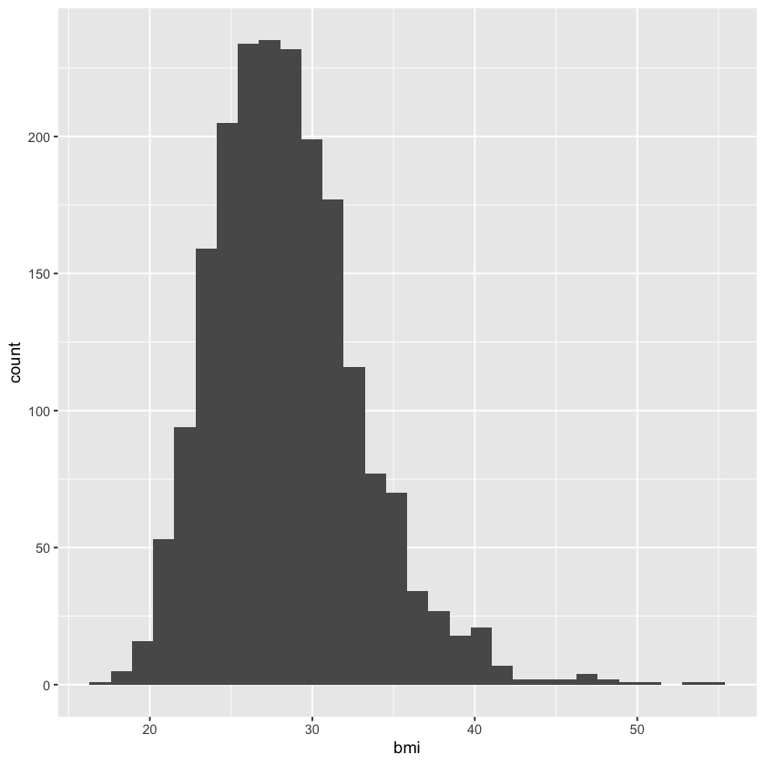
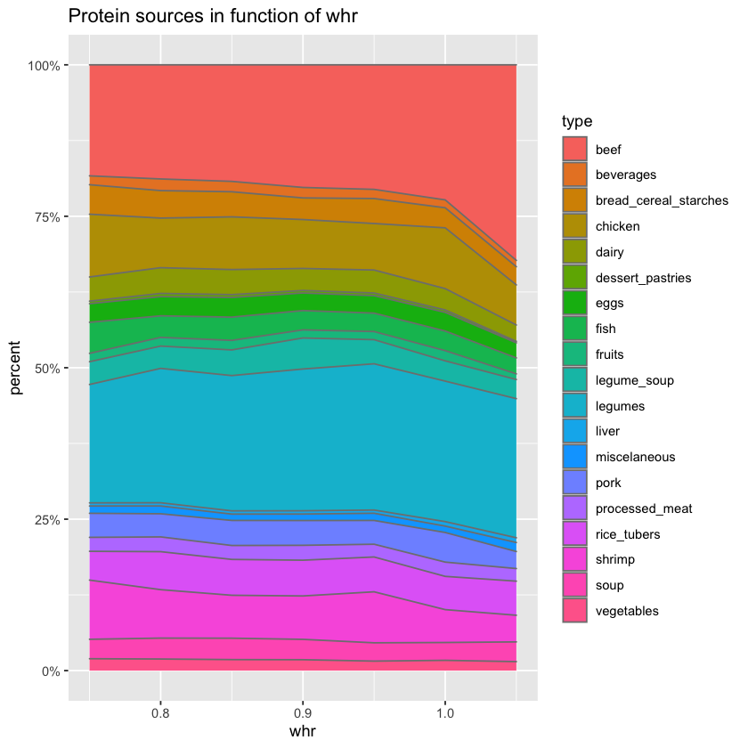
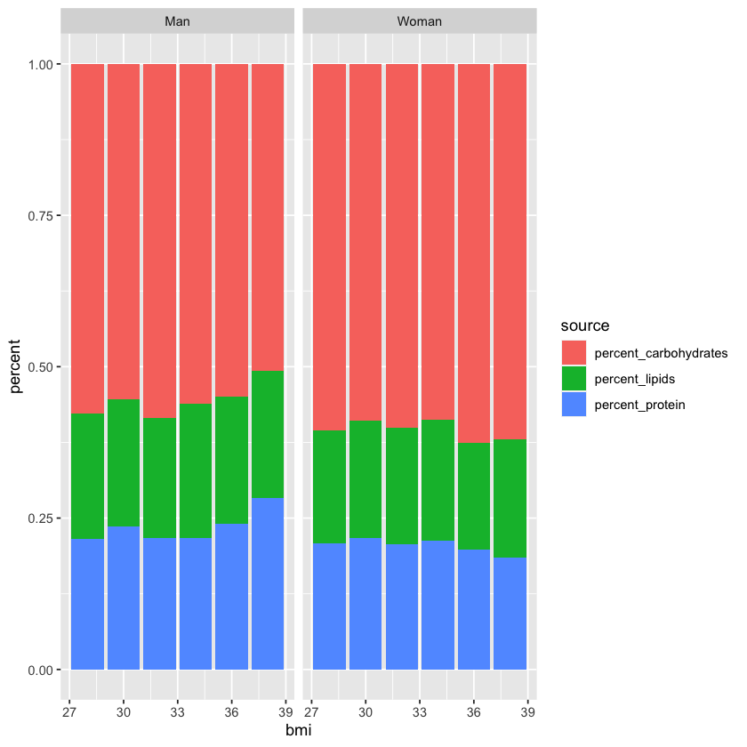
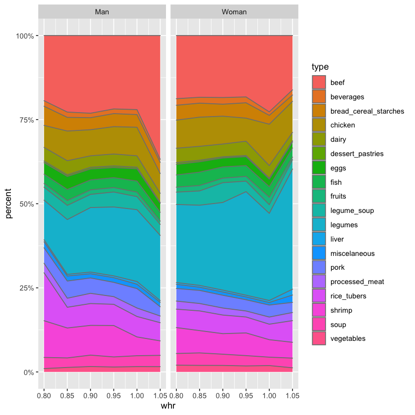

```R
library(tidyverse)
library(broom)
library(car)
library(rms)
```

    -- Attaching packages ---------------------------------------------------------------- tidyverse 1.3.1 --
    
    v ggplot2 3.3.3     v purrr   0.3.4
    v tibble  3.1.0     v dplyr   1.0.5
    v tidyr   1.1.3     v stringr 1.4.0
    v readr   1.4.0     v forcats 0.5.1
    
    -- Conflicts ------------------------------------------------------------------- tidyverse_conflicts() --
    x dplyr::filter() masks stats::filter()
    x dplyr::lag()    masks stats::lag()
    
    Loading required package: carData
    
    
    Attaching package: 'car'
    
    
    The following object is masked from 'package:dplyr':
    
        recode
    
    
    The following object is masked from 'package:purrr':
    
        some
    
    
    Loading required package: Hmisc
    
    Loading required package: lattice
    
    Loading required package: survival
    
    Loading required package: Formula
    
    
    Attaching package: 'Hmisc'
    
    
    The following objects are masked from 'package:dplyr':
    
        src, summarize
    
    
    The following objects are masked from 'package:base':
    
        format.pval, units
    
    
    Loading required package: SparseM
    
    
    Attaching package: 'SparseM'
    
    
    The following object is masked from 'package:base':
    
        backsolve
    
    
    
    Attaching package: 'rms'
    
    
    The following objects are masked from 'package:car':
    
        Predict, vif
    
    


```R
daily_info <- read_csv('./data/daily_info.csv') %>% 
                    mutate(name = case_when(name == 'total_lipid' ~ 'lipids', 
                                            name == 'carbohydrate_bydifference' ~ 'carbohydrates',
                                            name == 'fiber_totaldietary' ~ 'fiber',
                                            TRUE ~ name))
portions_and_mets <- read_csv('portions_and_mets.csv')
pure_processed <- read_csv('./data/pureData_processed.csv')
```

    
    -- Column specification ---------------------------------------------------------------------------------
    cols(
      id = col_double(),
      pure_name = col_character(),
      pure_portion = col_double(),
      weight_portion_gr = col_double(),
      type = col_character(),
      name = col_character(),
      amount_per_portion = col_double(),
      amount_per_day = col_double(),
      gr_per_day = col_double()
    )
    
    
    
    -- Column specification ---------------------------------------------------------------------------------
    cols(
      .default = col_double(),
      beef_cat = col_character(),
      dairy_cat = col_character(),
      legumes_cat = col_character(),
      white_meat_cat = col_character(),
      sex = col_character(),
      location_type = col_character(),
      education = col_character(),
      smokes = col_character(),
      drinks = col_character(),
      elevated_bp = col_logical(),
      elevated_wcm = col_logical(),
      elevated_triglycerids_mg_d_l = col_logical(),
      elevated_glucose_mg_d_l = col_logical(),
      low_hdl_mg_d_l = col_logical(),
      met_s = col_logical()
    )
    i<U+00A0>Use `spec()` for the full column specifications.
    
    
    
    -- Column specification ---------------------------------------------------------------------------------
    cols(
      .default = col_double(),
      sex = col_character(),
      education = col_character(),
      prediag = col_character(),
      years_after_diag = col_character(),
      medicated = col_character(),
      medication = col_character(),
      imc_diagnostico = col_character(),
      smokes = col_character(),
      community = col_character(),
      drinks = col_character(),
      h_aware = col_logical(),
      d_aware = col_logical(),
      c_aware = col_logical(),
      high_blood_pressure = col_logical(),
      high_blood_sugar_mg_d_l = col_logical(),
      high_triglycerids_mg_d_l = col_logical(),
      high_ldl_mg_d_l = col_logical(),
      high_total_cholesterol_mg_d_l = col_logical(),
      low_hdl_mg_d_l = col_logical(),
      abdominal_obesity_cm = col_logical()
      # ... with 25 more columns
    )
    i<U+00A0>Use `spec()` for the full column specifications.
    
    


```R
#pure_processed %>% names()
```


```R
daily_info %>% 
    filter(is.na(name)) %>% 
    distinct(pure_name)
```


<table class="dataframe">
<caption>A tibble: 0 × 1</caption>
<thead>
	<tr><th scope=col>pure_name</th></tr>
	<tr><th scope=col>&lt;chr&gt;</th></tr>
</thead>
<tbody>
</tbody>
</table>


```R
mets_conditions <- pure_processed %>% 
                        select(id, sex, income,
                               systolic = 'systolic_mean', 
                               diastolic = 'diastolic_mean', 
                               hdl, ldl, triglycerides, glucose, 
                               waist = waist_mean, bmi, whr,
                               d_diagnosed, h_diagnosed)
```


```R
mets_conditions %>% names()
```


<style>
.list-inline {list-style: none; margin:0; padding: 0}
.list-inline>li {display: inline-block}
.list-inline>li:not(:last-child)::after {content: "\00b7"; padding: 0 .5ex}
</style>
<ol class=list-inline><li>'id'</li><li>'sex'</li><li>'income'</li><li>'systolic'</li><li>'diastolic'</li><li>'hdl'</li><li>'ldl'</li><li>'triglycerides'</li><li>'glucose'</li><li>'waist'</li><li>'bmi'</li><li>'whr'</li><li>'d_diagnosed'</li><li>'h_diagnosed'</li></ol>


```R
energy_and_macronutrients  <- 
        daily_info %>% 
            filter(!is.na(name)) %>% 
            group_by(id, name) %>% 
            summarise(amount_per_day = sum(amount_per_day)) %>% 
            pivot_wider(names_from = name, values_from = amount_per_day) %>% 
            mutate(energy_macro = 3.75*carbohydrates + 4*protein + 9*lipids, 
                   percent_carbohydrate = 3.75*carbohydrates/energy_macro, 
                   percent_protein = 4*protein/energy_macro, 
                   percent_lipids = 9*lipids/energy_macro) %>%
            ungroup() %>% 
            inner_join(portions_and_mets %>% select(-c(waist, bmi, whr)), by = 'id') %>% 
            inner_join(mets_conditions, by = 'id') %>% 
            mutate_at(vars(matches("_cat")), fct_relevel, '≤ 0.5')

energy_and_macronutrients %>% head()
```

    `summarise()` has grouped output by 'id'. You can override using the `.groups` argument.
    
    Warning message:
    "Unknown levels in `f`: <U+2264> 0.5"
    Warning message:
    "Unknown levels in `f`: <U+2264> 0.5"
    Warning message:
    "Unknown levels in `f`: <U+2264> 0.5"
    Warning message:
    "Unknown levels in `f`: <U+2264> 0.5"


<table class="dataframe">
<caption>A tibble: 6 × 51</caption>
<thead>
	<tr><th scope=col>id</th><th scope=col>carbohydrates</th><th scope=col>energy</th><th scope=col>fiber</th><th scope=col>lipids</th><th scope=col>protein</th><th scope=col>energy_macro</th><th scope=col>percent_carbohydrate</th><th scope=col>percent_protein</th><th scope=col>percent_lipids</th><th scope=col>⋯</th><th scope=col>diastolic</th><th scope=col>hdl</th><th scope=col>ldl</th><th scope=col>triglycerides</th><th scope=col>glucose</th><th scope=col>waist</th><th scope=col>bmi</th><th scope=col>whr</th><th scope=col>d_diagnosed</th><th scope=col>h_diagnosed</th></tr>
	<tr><th scope=col>&lt;dbl&gt;</th><th scope=col>&lt;dbl&gt;</th><th scope=col>&lt;dbl&gt;</th><th scope=col>&lt;dbl&gt;</th><th scope=col>&lt;dbl&gt;</th><th scope=col>&lt;dbl&gt;</th><th scope=col>&lt;dbl&gt;</th><th scope=col>&lt;dbl&gt;</th><th scope=col>&lt;dbl&gt;</th><th scope=col>&lt;dbl&gt;</th><th scope=col>⋯</th><th scope=col>&lt;dbl&gt;</th><th scope=col>&lt;dbl&gt;</th><th scope=col>&lt;dbl&gt;</th><th scope=col>&lt;dbl&gt;</th><th scope=col>&lt;dbl&gt;</th><th scope=col>&lt;dbl&gt;</th><th scope=col>&lt;dbl&gt;</th><th scope=col>&lt;dbl&gt;</th><th scope=col>&lt;lgl&gt;</th><th scope=col>&lt;lgl&gt;</th></tr>
</thead>
<tbody>
	<tr><td>2500100101</td><td>770.9608</td><td>5580.666</td><td>123.22187</td><td>171.38187</td><td>275.8529</td><td>5536.952</td><td>0.5221471</td><td>0.1992815</td><td>0.2785715</td><td>⋯</td><td>71</td><td>54.9</td><td>133.2</td><td>280.1</td><td> 94.6</td><td> 79.3</td><td>27.2</td><td>0.8850446</td><td>FALSE</td><td>FALSE</td></tr>
	<tr><td>2500100201</td><td>469.9130</td><td>3395.204</td><td> 67.20909</td><td> 89.79881</td><td>197.8507</td><td>3361.766</td><td>0.5241810</td><td>0.2354129</td><td>0.2404062</td><td>⋯</td><td>89</td><td>83.9</td><td>165.3</td><td>134.4</td><td> 92.0</td><td> 92.6</td><td>28.2</td><td>0.8793922</td><td>FALSE</td><td>FALSE</td></tr>
	<tr><td>2500100301</td><td>506.2671</td><td>3145.253</td><td> 42.27424</td><td> 80.76115</td><td>105.7285</td><td>3048.266</td><td>0.6228137</td><td>0.1387392</td><td>0.2384472</td><td>⋯</td><td>75</td><td>40.4</td><td> 93.7</td><td>184.1</td><td> 97.5</td><td> 99.5</td><td>28.9</td><td>1.0000000</td><td>FALSE</td><td> TRUE</td></tr>
	<tr><td>2500100302</td><td>505.9751</td><td>4522.306</td><td> 63.24273</td><td>153.58089</td><td>287.3866</td><td>4429.181</td><td>0.4283877</td><td>0.2595393</td><td>0.3120730</td><td>⋯</td><td>74</td><td>48.3</td><td>133.5</td><td>104.3</td><td> 79.0</td><td>104.0</td><td>26.9</td><td>1.1075612</td><td>FALSE</td><td>FALSE</td></tr>
	<tr><td>2500100401</td><td>446.0787</td><td>3402.737</td><td> 48.43991</td><td> 93.26682</td><td>203.9722</td><td>3328.085</td><td>0.5026299</td><td>0.2451526</td><td>0.2522175</td><td>⋯</td><td>93</td><td>37.2</td><td>204.2</td><td>153.9</td><td>125.5</td><td>105.3</td><td>31.9</td><td>1.0425743</td><td>FALSE</td><td> TRUE</td></tr>
	<tr><td>2500100402</td><td>324.1356</td><td>2465.029</td><td> 36.35588</td><td> 67.69798</td><td>147.7826</td><td>2415.921</td><td>0.5031244</td><td>0.2446812</td><td>0.2521945</td><td>⋯</td><td>90</td><td>69.1</td><td>137.9</td><td>193.1</td><td>157.9</td><td> 84.2</td><td>25.0</td><td>0.8394816</td><td> TRUE</td><td> TRUE</td></tr>
</tbody>
</table>


```R
energy_and_macronutrients %>%
    write_csv("~/gitrepos/mets_tables/macronutrientes.csv")
```

## Macronutrients and conditions


```R
energy_and_macronutrients %>% 
    select(contains("percent_")) %>% 
    pivot_longer(cols = contains("percent_"), names_to = "source", values_to = "percent") %>% 
    group_by(source) %>% 
    summarise(m_macro = round(100*mean(percent), 1), sd_macro = round(100*sd(percent), 1))
```


<table class="dataframe">
<caption>A tibble: 3 × 3</caption>
<thead>
	<tr><th scope=col>source</th><th scope=col>m_macro</th><th scope=col>sd_macro</th></tr>
	<tr><th scope=col>&lt;chr&gt;</th><th scope=col>&lt;dbl&gt;</th><th scope=col>&lt;dbl&gt;</th></tr>
</thead>
<tbody>
	<tr><td>percent_carbohydrate</td><td>54.7</td><td>7.8</td></tr>
	<tr><td>percent_lipids      </td><td>22.8</td><td>5.3</td></tr>
	<tr><td>percent_protein     </td><td>22.5</td><td>4.9</td></tr>
</tbody>
</table>


```R
t_test_macro <- function(condition, macro){
    
    t_df <- energy_and_macronutrients %>% 
                mutate(overweight_obesity = ifelse(bmi >= 25, TRUE, FALSE)) %>% 
                na.omit() %>% 
                select(condition, macro) 

    t <- t.test(x = t_df %>% filter(get(condition) == TRUE), 
                y = t_df %>% filter(get(condition) == FALSE))
    
    return(t)
}
```


```R
energy_met_s <- energy_and_macronutrients %>% 
    na.omit() %>% 
    select(met_s, energy) %>% 
    pivot_longer(cols = -met_s, names_to = 'source', values_to = 'percent') %>% 
    group_by(met_s, source) %>% 
    summarise(m_percent = mean(percent), sd_percent = sd(percent)) %>% 
    mutate(m_percent = round(m_percent, 0), sd_percent = round(sd_percent, 0), 
           dist = paste(m_percent,sd_percent, sep='')) %>% 
    select(met_s, source, dist) %>% 
    pivot_wider(names_from = met_s, values_from = dist) %>% 
    mutate(condition = 'met_s') %>% 
    bind_cols(p_val = round(t_test_macro("met_s", "energy")$p.val, 3))
```

    `summarise()` has grouped output by 'met_s'. You can override using the `.groups` argument.
    


```R
mets_macro <- energy_and_macronutrients %>% 
    na.omit() %>% 
    select(met_s, contains('percent')) %>% 
    pivot_longer(cols = -met_s, names_to = 'source', values_to = 'percent') %>% 
    mutate(source = str_remove(source, 'percent_')) %>% 
    group_by(met_s, source) %>% 
    summarise(m_percent = mean(percent), sd_percent = sd(percent)) %>% 
    mutate(m_percent = round(100*m_percent, 0), sd_percent = round(100*sd_percent, 0), 
           dist = paste(m_percent, '% ', sd_percent, '%', sep='')) %>% 
    select(met_s, source, dist) %>% 
    pivot_wider(names_from = met_s, values_from = dist) %>% 
    mutate(condition = 'met_s') %>% 
    bind_cols(tibble(p_val = c(t_test_macro("met_s", "carbohydrates")$p.val, 
                               t_test_macro("met_s", "lipids")$p.val, 
                               t_test_macro("met_s", "protein")$p.val))) %>% 
    mutate(p_val = round(p_val, 3))
```

    `summarise()` has grouped output by 'met_s'. You can override using the `.groups` argument.
    


```R
dm2_macro <- energy_and_macronutrients %>% 
    na.omit() %>% 
    select(d_diagnosed, contains('percent')) %>% 
    pivot_longer(cols = -d_diagnosed, names_to = 'source', values_to = 'percent') %>% 
    mutate(source = str_remove(source, 'percent_')) %>% 
    group_by(d_diagnosed, source) %>% 
    summarise(m_percent = mean(percent), sd_percent = sd(percent)) %>% 
    mutate(m_percent = round(100*m_percent, 0), sd_percent = round(100*sd_percent, 0), 
           dist = paste(m_percent, '% ', sd_percent, '%', sep='')) %>% 
    select(d_diagnosed, source, dist) %>% 
    pivot_wider(names_from = d_diagnosed, values_from = dist)%>% 
    mutate(condition = 'dm2') %>% 
    bind_cols(tibble(p_val = c(t_test_macro("d_diagnosed", "carbohydrates")$p.val, 
                               t_test_macro("d_diagnosed", "lipids")$p.val, 
                               t_test_macro("d_diagnosed", "protein")$p.val))) %>% 
    mutate(p_val = round(p_val, 3))
```

    `summarise()` has grouped output by 'd_diagnosed'. You can override using the `.groups` argument.
    


```R
energy_dm2 <- energy_and_macronutrients %>% 
    na.omit() %>% 
    select(d_diagnosed, energy) %>% 
    pivot_longer(cols = -d_diagnosed, names_to = 'source', values_to = 'percent') %>% 
    group_by(d_diagnosed, source) %>% 
    summarise(m_percent = mean(percent), sd_percent = sd(percent)) %>% 
    mutate(m_percent = round(m_percent, 0), sd_percent = round(sd_percent, 0), 
           dist = paste(m_percent, sd_percent, sep='')) %>% 
    select(d_diagnosed, source, dist) %>% 
    pivot_wider(names_from = d_diagnosed, values_from = dist) %>% 
    mutate(condition = 'd_diagnosed') %>% 
    bind_cols(p_val = round(t_test_macro("d_diagnosed", "energy")$p.val, 3))
```

    `summarise()` has grouped output by 'd_diagnosed'. You can override using the `.groups` argument.
    


```R
overob_macro <- energy_and_macronutrients %>% 
    mutate(overweight_obesity = ifelse(bmi >= 25, TRUE, FALSE)) %>% 
    na.omit() %>% 
    select(overweight_obesity, contains('percent')) %>% 
    pivot_longer(cols = -overweight_obesity, names_to = 'source', values_to = 'percent') %>% 
    mutate(source = str_remove(source, 'percent_')) %>% 
    group_by(overweight_obesity, source) %>% 
    summarise(m_percent = mean(percent), sd_percent = sd(percent)) %>% 
    mutate(m_percent = round(100*m_percent, 0), sd_percent = round(100*sd_percent, 0), 
           dist = paste(m_percent, '% ', sd_percent, '%', sep='')) %>% 
    select(overweight_obesity, source, dist) %>% 
    pivot_wider(names_from = overweight_obesity, values_from = dist) %>% 
    mutate(condition = 'overweight_obesity') %>% 
    bind_cols(tibble(p_val = c(t_test_macro("overweight_obesity", "carbohydrates")$p.val, 
                               t_test_macro("overweight_obesity", "lipids")$p.val, 
                               t_test_macro("overweight_obesity", "protein")$p.val))) %>% 
    mutate(p_val = round(p_val, 3))
```

    `summarise()` has grouped output by 'overweight_obesity'. You can override using the `.groups` argument.
    


```R
energy_overob <- energy_and_macronutrients %>% 
    mutate(overweight_obesity = ifelse(bmi >= 25, TRUE, FALSE)) %>% 
    na.omit() %>% 
    select(overweight_obesity, energy) %>% 
    pivot_longer(cols = -overweight_obesity, names_to = 'source', values_to = 'percent') %>% 
    group_by(overweight_obesity, source) %>% 
    summarise(m_percent = mean(percent), sd_percent = sd(percent)) %>% 
    mutate(m_percent = round(m_percent, 0), sd_percent = round(sd_percent, 0), 
           dist = paste(m_percent, sd_percent, sep='')) %>% 
    select(overweight_obesity, source, dist) %>% 
    pivot_wider(names_from = overweight_obesity, values_from = dist) %>% 
    mutate(condition = 'overweight_obesity') %>% 
    bind_cols(p_val = round(t_test_macro("overweight_obesity", "energy")$p.val, 3))
```

    `summarise()` has grouped output by 'overweight_obesity'. You can override using the `.groups` argument.
    


```R
bind_rows(mets_macro, dm2_macro, overob_macro) %>% 
    write_csv('macro_conds.csv')

bind_rows(energy_met_s, energy_dm2, energy_overob) %>% 
    write_csv('energy_conds.csv')
```


```R
bind_rows(mets_macro, dm2_macro, overob_macro) 
```


<table class="dataframe">
<caption>A tibble: 9 × 5</caption>
<thead>
	<tr><th scope=col>source</th><th scope=col>FALSE</th><th scope=col>TRUE</th><th scope=col>condition</th><th scope=col>p_val</th></tr>
	<tr><th scope=col>&lt;chr&gt;</th><th scope=col>&lt;chr&gt;</th><th scope=col>&lt;chr&gt;</th><th scope=col>&lt;chr&gt;</th><th scope=col>&lt;dbl&gt;</th></tr>
</thead>
<tbody>
	<tr><td>carbohydrate</td><td>54% 8%</td><td>55% 8%</td><td>met_s             </td><td>0.589</td></tr>
	<tr><td>lipids      </td><td>23% 5%</td><td>22% 5%</td><td>met_s             </td><td>0.841</td></tr>
	<tr><td>protein     </td><td>22% 5%</td><td>23% 5%</td><td>met_s             </td><td>0.394</td></tr>
	<tr><td>carbohydrate</td><td>55% 8%</td><td>55% 8%</td><td>dm2               </td><td>0.843</td></tr>
	<tr><td>lipids      </td><td>23% 5%</td><td>22% 6%</td><td>dm2               </td><td>0.214</td></tr>
	<tr><td>protein     </td><td>22% 5%</td><td>23% 5%</td><td>dm2               </td><td>0.537</td></tr>
	<tr><td>carbohydrate</td><td>55% 8%</td><td>55% 8%</td><td>overweight_obesity</td><td>0.954</td></tr>
	<tr><td>lipids      </td><td>23% 5%</td><td>23% 5%</td><td>overweight_obesity</td><td>0.450</td></tr>
	<tr><td>protein     </td><td>22% 5%</td><td>23% 5%</td><td>overweight_obesity</td><td>0.427</td></tr>
</tbody>
</table>


```R
bind_rows(energy_met_s, energy_dm2, energy_overob)
```


<table class="dataframe">
<caption>A tibble: 3 × 5</caption>
<thead>
	<tr><th scope=col>source</th><th scope=col>FALSE</th><th scope=col>TRUE</th><th scope=col>condition</th><th scope=col>p_val</th></tr>
	<tr><th scope=col>&lt;chr&gt;</th><th scope=col>&lt;chr&gt;</th><th scope=col>&lt;chr&gt;</th><th scope=col>&lt;chr&gt;</th><th scope=col>&lt;dbl&gt;</th></tr>
</thead>
<tbody>
	<tr><td>energy</td><td>39442498</td><td>40132218</td><td>met_s             </td><td>0.675</td></tr>
	<tr><td>energy</td><td>39762398</td><td>39632204</td><td>d_diagnosed       </td><td>0.965</td></tr>
	<tr><td>energy</td><td>39372043</td><td>39852467</td><td>overweight_obesity</td><td>0.800</td></tr>
</tbody>
</table>


## Normal BMI?


```R
mets_conditions %>% 
    ggplot(aes(bmi)) + 
        geom_histogram()
```

    `stat_bin()` using `bins = 30`. Pick better value with `binwidth`.
    
    Warning message:
    “Removed 1 rows containing non-finite values (stat_bin).”


    

    


```R
mets_conditions %>% 
    filter(percent_rank(whr) <= 0.985, percent_rank(whr) >= 0.025) %>%
    mutate(whr = 0.1 * (whr %/% 0.1)) %>% 
    count(whr) 
```


<table>
<caption>A tibble: 4 × 2</caption>
<thead>
	<tr><th scope=col>whr</th><th scope=col>n</th></tr>
	<tr><th scope=col>&lt;dbl&gt;</th><th scope=col>&lt;int&gt;</th></tr>
</thead>
<tbody>
	<tr><td>0.7</td><td> 97</td></tr>
	<tr><td>0.8</td><td>916</td></tr>
	<tr><td>0.9</td><td>796</td></tr>
	<tr><td>1.0</td><td>108</td></tr>
</tbody>
</table>


# Percent in function of conditions:


```R
macronutrients_percent <- function(var_names, var_df){
    mn_df <- daily_info %>% 
                select(id, name, type, amount_per_day) %>% 
                inner_join(var_df, by = 'id') %>% 
                group_by(name, get(var_names)) %>% 
                summarise(amount_per_day = mean(amount_per_day)) %>% 
                pivot_wider(names_from = name, values_from = amount_per_day) %>% 
                mutate(total_energy = 4*carbohydrates + 4*protein + 6.9*lipids, 
                       percent_protein = 4*protein / total_energy, 
                       percent_lipids = 6.9*lipids / total_energy, 
                       percent_carbohydrates = 4*carbohydrates / total_energy) %>% 
                select(var = `get(var_names)`, contains('percent')) %>% 
                filter(percent_rank(var) <= 0.90, percent_rank(var) >= 0.02) %>% 
                pivot_longer(cols = -var, names_to = 'source', values_to = 'percent') 
    
    return(mn_df)
}
```


```R
var_tibble <- function(var_names, smooth_param, mets_tibble){
    
    var_df <- mets_tibble %>% 
            select(id, var = var_names) %>% 
            mutate(var = smooth_param * (var %/% smooth_param)) %>% 
            filter(percent_rank(var) <= 0.975, percent_rank(var) >= 0.25)
    
    return(var_df)

}
```


```R
mets_conditions_man <- mets_conditions %>% filter(sex == 'Man')
whr_df_man <- var_tibble('whr', 0.02, mets_conditions_man) %>% rename(whr = 'var')
whr_man <- macronutrients_percent('whr', whr_df_man) %>% 
                rename(whr = 'var') %>% 
                ggplot(aes(whr, percent, fill = source)) + geom_area()
```


```R
mets_conditions_woman <- mets_conditions %>% filter(sex == 'Woman')
whr_df_woman <- var_tibble('whr', 0.02, mets_conditions_woman) %>% rename(whr = 'var')
whr_woman <- macronutrients_percent('whr', whr_df_woman) %>% 
                    rename(whr = 'var') %>% 
                    ggplot(aes(whr, percent, fill = source)) + geom_area()
```

## Nutrient sources in function of the condition:


```R
food_percent <- function(var, var_df){
    
    food_percent_df <- 
        daily_info %>% 
            filter(name != 'energy') %>% 
            select(id, name, type, amount_per_day) %>% 
            group_by(id, type, name) %>%    
            summarise(amount_per_day = sum(amount_per_day)) %>% 
            inner_join(var_df, by = 'id') %>% 
            group_by(name, type, get(var)) %>% 
            summarise(amount_per_day = mean(amount_per_day)) %>% 
            group_by(name, `get(var)`) %>% 
            mutate(percent = amount_per_day/sum(amount_per_day)) %>% 
            ungroup()
    
    return(food_percent_df)
}
```


```R
spinogram_souce <- function(macro_nutrient, food_percent_df){
    
    food_percent_df %>% 
    filter(name == macro_nutrient) %>%
    ggplot(aes(whr, percent, fill = type)) +
                geom_area(color = 'grey50') +
                scale_y_continuous(labels = scales::percent_format())
    }
```


```R
var_df <- mets_conditions %>% 
            select(id, sex, whr) %>% 
            mutate(whr = 0.05 * (whr %/% 0.05)) %>% 
            filter(percent_rank(whr) <= 0.99, percent_rank(whr) >= 0.01)

food_percent_df <- food_percent('whr', var_df) %>% rename(whr = `get(var)`)
#food_percent_df %>% head()

spinogram_souce('protein', food_percent_df) +
    labs(title = 'Protein sources in function of whr')
```


    

    


# whr by sex


```R
smooth_param  <- 2
bmi_df <- mets_conditions %>% 
            select(id, bmi , sex) %>% 
            mutate(bmi = smooth_param * (bmi %/% smooth_param)) %>% 
            filter(percent_rank(bmi) <= 0.975, percent_rank(bmi) >= 0.25)

daily_info %>% 
        select(id, name, type, amount_per_day) %>% 
        inner_join(bmi_df, by = 'id') %>% 
        group_by(name, bmi, sex) %>% 
        summarise(amount_per_day = mean(amount_per_day)) %>% 
        pivot_wider(names_from = name, values_from = amount_per_day) %>% 
        mutate(total_energy = 4*carbohydrates + 4*protein + 6.9*lipids, 
               percent_protein = 4*protein / total_energy, 
               percent_lipids = 6.9*lipids / total_energy, 
               percent_carbohydrates = 4*carbohydrates / total_energy) %>% 
        select(bmi, sex, contains('percent')) %>% 
        pivot_longer(cols = -c(sex, bmi), names_to = 'source', values_to = 'percent') %>% 
        ungroup() %>% 
        filter(percent_rank(bmi) <= 0.975, percent_rank(bmi) >= 0.025) %>%
        ggplot(aes(bmi, percent, fill = source)) + 
            geom_col() +
            facet_wrap(~sex)
```


    

    


```R
food_percent_whr_sex <- daily_info %>% 
            filter(name != 'energy') %>% 
            select(id, name, type, amount_per_day) %>% 
            group_by(id, type, name) %>%    
            summarise(amount_per_day = sum(amount_per_day)) %>% 
            inner_join(var_df, by = 'id') %>% 
            group_by(name, type, sex, whr) %>% 
            summarise(amount_per_day = mean(amount_per_day)) %>% 
            group_by(name, sex, whr) %>% 
            mutate(percent = amount_per_day/sum(amount_per_day)) %>% 
            ungroup() %>%
            filter(percent_rank(whr) <= 0.975, percent_rank(whr) >= 0.025) 

food_percent_whr_sex %>%
            filter(name == 'protein')  %>% 
            ggplot(aes(whr, percent, fill = type)) +
                    geom_area(color = 'grey50') +
                    scale_y_continuous(labels = scales::percent_format()) +
                    facet_wrap(~sex)
```


    

    


```R
food_percent_whr_sex %>% 
        filter(type %in% c('fruits', 'legumes',
                           'bread_cereal_starches', 'rice_tubers')) %>% 
            filter(name == 'protein')  %>% 
            ggplot(aes(whr, percent, fill = sex)) +
                    geom_area(color = 'grey50', position = 'dodge', alpha = 0.5) +
                    scale_y_continuous(labels = scales::percent_format()) +
                    facet_wrap(~type)
```

    Warning message:
    “Width not defined. Set with `position_dodge(width = ?)`”


    

    


```R
mets_conditions %>% 
    filter(percent_rank(whr) <= 0.975, percent_rank(whr) >= 0.025) %>%
    mutate(whr = 0.04 * (whr %/% 0.04)) %>% 
    count(whr)
```


<table>
<caption>A tibble: 8 × 2</caption>
<thead>
	<tr><th scope=col>whr</th><th scope=col>n</th></tr>
	<tr><th scope=col>&lt;dbl&gt;</th><th scope=col>&lt;int&gt;</th></tr>
</thead>
<tbody>
	<tr><td>0.76</td><td> 97</td></tr>
	<tr><td>0.80</td><td>278</td></tr>
	<tr><td>0.84</td><td>407</td></tr>
	<tr><td>0.88</td><td>438</td></tr>
	<tr><td>0.92</td><td>350</td></tr>
	<tr><td>0.96</td><td>239</td></tr>
	<tr><td>1.00</td><td> 84</td></tr>
	<tr><td>1.04</td><td>  4</td></tr>
</tbody>
</table>


```R

```
