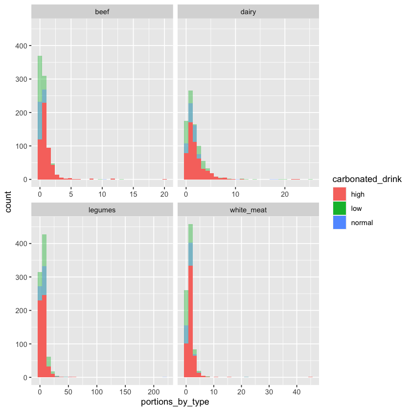
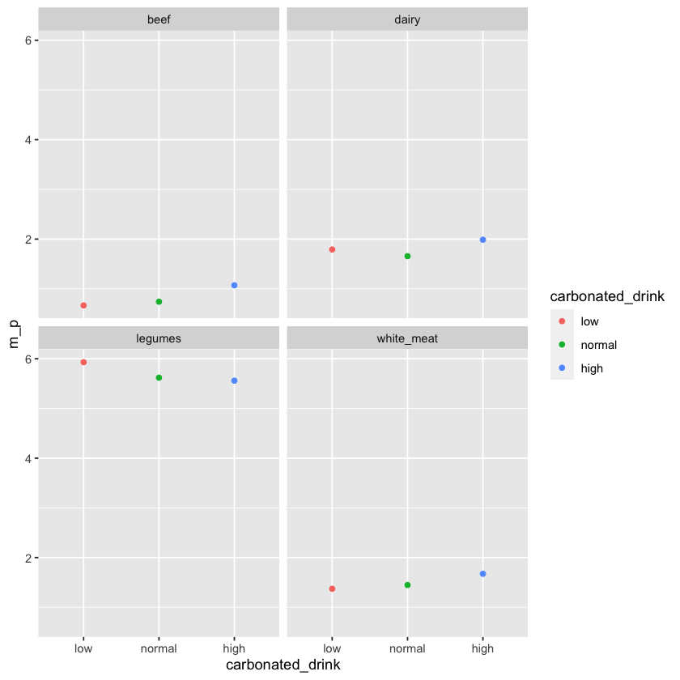
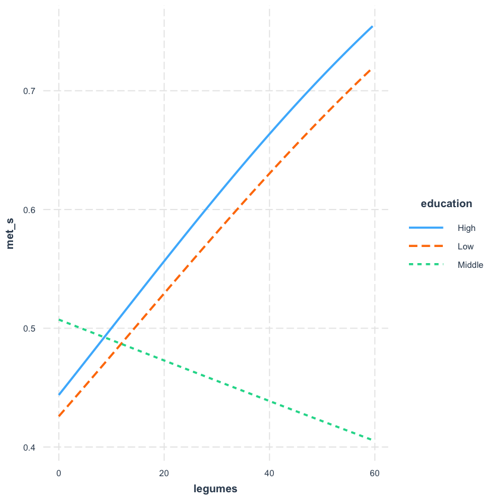
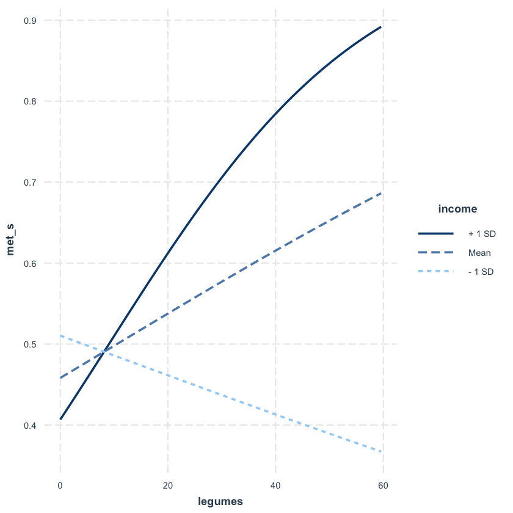
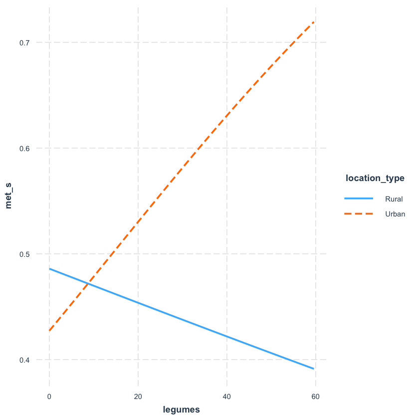
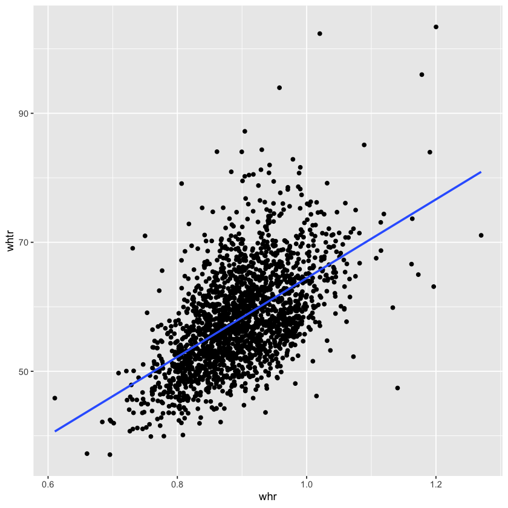

```R
library(tidyverse)
```

    ── Attaching packages ─────────────────────────────────────────────────────────────────────────────── tidyverse 1.3.0 ──
    
    ✔ ggplot2 3.3.3     ✔ purrr   0.3.4
    ✔ tibble  3.1.0     ✔ dplyr   1.0.5
    ✔ tidyr   1.1.3     ✔ stringr 1.4.0
    ✔ readr   1.4.0     ✔ forcats 0.5.1
    
    ── Conflicts ────────────────────────────────────────────────────────────────────────────────── tidyverse_conflicts() ──
    ✖ dplyr::filter() masks stats::filter()
    ✖ dplyr::lag()    masks stats::lag()
    


```R
diet_info <- read_csv('../data/diet_info.csv')
conditions_info <- read_csv('../data/conditions_info.csv') 
macro_port_info <- read_csv('../data/macro_nut_portions_info.csv')
pa_info <- read_csv('../data/pa_info.csv')
legumes_types_info <- read_csv('../data/legume_types_info.csv')
```

    
    ── Column specification ────────────────────────────────────────────────────────────────────────────────────────────────
    cols(
      id = col_double(),
      type = col_character(),
      portions_by_type = col_double()
    )
    
    
    
    ── Column specification ────────────────────────────────────────────────────────────────────────────────────────────────
    cols(
      .default = col_double(),
      education = col_character(),
      sex = col_character(),
      location_type = col_character(),
      smokes = col_character(),
      drinks = col_character(),
      elevated_bp = col_logical(),
      elevated_triglycerids_mg_d_l = col_logical(),
      elevated_glucose_mg_d_l = col_logical(),
      low_hdl_mg_d_l = col_logical(),
      met_s = col_logical(),
      d_diagnosed = col_logical(),
      h_diagnosed = col_logical()
    )
    ℹ Use `spec()` for the full column specifications.
    
    
    
    ── Column specification ────────────────────────────────────────────────────────────────────────────────────────────────
    cols(
      id = col_double(),
      carbohydrates = col_double(),
      energy = col_double(),
      fiber = col_double(),
      lipids = col_double(),
      protein = col_double(),
      energy_macro = col_double(),
      percent_carbohydrate = col_double(),
      percent_protein = col_double(),
      percent_lipids = col_double(),
      beef_cat = col_character(),
      dairy_cat = col_character(),
      legumes_cat = col_character(),
      white_meat_cat = col_character(),
      beef = col_double(),
      dairy = col_double(),
      legumes = col_double(),
      white_meat = col_double()
    )
    
    
    
    ── Column specification ────────────────────────────────────────────────────────────────────────────────────────────────
    cols(
      id = col_double(),
      l_pa = col_double(),
      m_pa = col_double(),
      v_pa = col_double(),
      total_pa = col_double(),
      sum_pa = col_double()
    )
    
    
    
    ── Column specification ────────────────────────────────────────────────────────────────────────────────────────────────
    cols(
      id = col_double(),
      pure_name = col_character(),
      pure_portion = col_double(),
      total = col_double()
    )
    
    


# Association between carbonated drinks and MetS


```R
diet_info %>%
    filter(type == "carbonated_drink") %>%
    .$portions_by_type %>%
    quantile(probs = c(1/3, 2/3))
```


<style>
.dl-inline {width: auto; margin:0; padding: 0}
.dl-inline>dt, .dl-inline>dd {float: none; width: auto; display: inline-block}
.dl-inline>dt::after {content: ":\0020"; padding-right: .5ex}
.dl-inline>dt:not(:first-of-type) {padding-left: .5ex}
</style><dl class=dl-inline><dt>33.33333%</dt><dd>0</dd><dt>66.66667%</dt><dd>0.14</dd></dl>


```R
dcd <- diet_info %>%
    filter(type == "carbonated_drink") %>%
    mutate(carbonated_drink = 
               case_when(portions_by_type == 0 ~ "low", 
                        portions_by_type <= 0.14 ~ "normal", 
                        portions_by_type > 0.14 ~ "high")) %>%
    select(id, carbonated_drink) %>%
    inner_join(diet_info, by = "id") %>%
    filter(type != "carbonated_drink") 
```


```R
ggplot(dcd, aes(portions_by_type, fill = carbonated_drink)) +
    geom_histogram(data = dcd %>% filter(carbonated_drink == "low"),
                  alpha = 0.4) +
    geom_histogram(data = dcd %>% filter(carbonated_drink == "normal"),
                  alpha = 0.4) +
    geom_histogram(data = dcd %>% filter(carbonated_drink == "high")) +
    facet_wrap(~type, scales = "free_x")
```

    `stat_bin()` using `bins = 30`. Pick better value with `binwidth`.
    
    `stat_bin()` using `bins = 30`. Pick better value with `binwidth`.
    
    `stat_bin()` using `bins = 30`. Pick better value with `binwidth`.
    


    

    


```R
dcd %>%
    group_by(carbonated_drink, type) %>%
    summarise(m_p = mean(portions_by_type), 
              sd_p = sd(portions_by_type)) %>%
    mutate(carbonated_drink = as.factor(carbonated_drink),
          carbonated_drink = 
           fct_relevel(carbonated_drink, c("low", "normal"))) %>%
    ggplot(aes(x = carbonated_drink, 
               y = m_p, 
               color = carbonated_drink)) +
    geom_point() +
    facet_wrap(~type)
```

    `summarise()` has grouped output by 'carbonated_drink'. You can override using the `.groups` argument.
    


    

    


```R
low_legumes <- dcd %>% 
        filter(type == "legumes", carbonated_drink == "low") %>%
        pull(portions_by_type)

normal_legumes <- dcd %>% 
        filter(type == "legumes", carbonated_drink == "normal") %>%
        pull(portions_by_type)

high_legumes <- dcd %>% 
        filter(type == "legumes", carbonated_drink == "high") %>%
        pull(portions_by_type)

wilcox.test(low_legumes, normal_legumes)
wilcox.test(low_legumes, high_legumes)
wilcox.test(normal_legumes, high_legumes)
```


    
    	Wilcoxon rank sum test with continuity correction
    
    data:  low_legumes and normal_legumes
    W = 286602, p-value = 0.01968
    alternative hypothesis: true location shift is not equal to 0


    
    	Wilcoxon rank sum test with continuity correction
    
    data:  low_legumes and high_legumes
    W = 230946, p-value = 0.04055
    alternative hypothesis: true location shift is not equal to 0


    
    	Wilcoxon rank sum test with continuity correction
    
    data:  normal_legumes and high_legumes
    W = 168096, p-value = 0.9654
    alternative hypothesis: true location shift is not equal to 0


# Comparing models with and without carbonated drinks:


```R
portions_cat  <- seq(0, 1, 0.5)


drinks_info <- 
    dcd %>% 
        select(id, carbonated_drink) %>%
        distinct(id, carbonated_drink)

energy_info <- 
        macro_port_info %>% 
        select(id, diet_energy = energy) 


portions_info <- 
    dcd %>%
        select(-carbonated_drink) %>%
        pivot_wider(names_from = type, values_from = portions_by_type)

```


```R
portions_and_mets_df <- 
    dcd %>%
        mutate(type = paste(type, '_cat', sep = ''), 
               portions_cat = cut(portions_by_type, 
                                   labels = 
                                      c('[0, 0.5]', ']0.5, 1]', '1+'),
                                   breaks = c(portions_cat, Inf), 
                                   include.lowest = TRUE)) %>%
        select(-carbonated_drink, -portions_by_type) %>%
        pivot_wider(names_from = type, values_from = portions_cat) %>%
        inner_join(drinks_info, by = "id") %>%
        inner_join(energy_info, by = "id") %>%
        inner_join(conditions_info, by = "id") %>%
        inner_join(pa_info, by = "id")
    
```


```R
mod_metS_drinks <- glm(met_s ~ sex + age + 
                bmi + whr +
                location_type + education + income +
                smokes + drinks + 
                diet_energy + total_pa +
                carbonated_drink +
                beef_cat + dairy_cat + white_meat_cat + legumes_cat, 
                portions_and_mets_df, family=binomial)

```


```R
mod_diab_drinks <- glm(d_diagnosed ~ sex + age + 
                bmi + whr +
                location_type + education + income +
                smokes + drinks + 
                diet_energy + total_pa +
                carbonated_drink +
                beef_cat + dairy_cat + white_meat_cat + legumes_cat, 
                portions_and_mets_df, family=binomial)
```


```R
mod_ht_drinks <- glm(h_diagnosed ~ sex + age + 
                bmi + whr +
                location_type + education + income +
                smokes + drinks + 
                diet_energy + total_pa +
                carbonated_drink +
                beef_cat + dairy_cat + white_meat_cat + legumes_cat, 
                portions_and_mets_df, family=binomial)
```


```R
mod_metS <- glm(met_s ~ sex + age + 
                bmi + whr +
                location_type + education + income +
                smokes + drinks + 
                diet_energy + total_pa +
                beef_cat + dairy_cat + white_meat_cat + legumes_cat, 
                portions_and_mets_df, family=binomial)
```


```R
mod_diab <- glm(d_diagnosed ~ sex + age + 
                bmi + whr +
                location_type + education + income +
                smokes + drinks + 
                diet_energy + total_pa +
                beef_cat + dairy_cat + white_meat_cat + legumes_cat, 
                portions_and_mets_df, family=binomial)
```


```R
mod_ht <- glm(h_diagnosed ~ sex + age + 
                bmi + whr +
                location_type + education + income +
                smokes + drinks + 
                diet_energy + total_pa +
                beef_cat + dairy_cat + white_meat_cat + legumes_cat, 
                portions_and_mets_df, family=binomial)
```

#### MetS


```R
summary(mod_metS_drinks)
```


    
    Call:
    glm(formula = met_s ~ sex + age + bmi + whr + location_type + 
        education + income + smokes + drinks + diet_energy + total_pa + 
        carbonated_drink + beef_cat + dairy_cat + white_meat_cat + 
        legumes_cat, family = binomial, data = portions_and_mets_df)
    
    Deviance Residuals: 
        Min       1Q   Median       3Q      Max  
    -2.5883  -0.9021  -0.5118   1.0332   2.3013  
    
    Coefficients:
                             Estimate Std. Error z value Pr(>|z|)    
    (Intercept)            -1.129e+01  9.876e-01 -11.431  < 2e-16 ***
    sexWoman                2.151e-01  1.598e-01   1.346  0.17830    
    age                     3.863e-02  5.715e-03   6.760 1.38e-11 ***
    bmi                     1.573e-01  1.354e-02  11.619  < 2e-16 ***
    whr                     6.162e+00  9.257e-01   6.656 2.81e-11 ***
    location_typeUrban     -8.609e-02  1.093e-01  -0.788  0.43070    
    educationLow           -6.224e-02  1.780e-01  -0.350  0.72664    
    educationMiddle         1.068e-01  1.706e-01   0.626  0.53104    
    income                 -9.808e-05  7.915e-05  -1.239  0.21527    
    smokesFormerly         -2.743e-01  2.593e-01  -1.058  0.29013    
    smokesNever            -1.031e-01  2.324e-01  -0.444  0.65721    
    drinksFormerly         -3.326e-02  1.951e-01  -0.170  0.86465    
    drinksNever             1.073e-01  1.656e-01   0.648  0.51710    
    diet_energy             4.937e-05  2.408e-05   2.050  0.04035 *  
    total_pa               -2.001e-05  3.261e-04  -0.061  0.95108    
    carbonated_drinklow     1.912e-01  1.336e-01   1.431  0.15239    
    carbonated_drinknormal -9.025e-02  1.378e-01  -0.655  0.51241    
    beef_cat]0.5, 1]       -2.925e-02  1.235e-01  -0.237  0.81276    
    beef_cat1+              7.317e-02  1.353e-01   0.541  0.58862    
    dairy_cat]0.5, 1]      -8.384e-02  1.604e-01  -0.523  0.60119    
    dairy_cat1+            -2.835e-01  1.358e-01  -2.087  0.03688 *  
    white_meat_cat]0.5, 1] -4.840e-02  1.812e-01  -0.267  0.78937    
    white_meat_cat1+       -3.640e-02  1.740e-01  -0.209  0.83428    
    legumes_cat]0.5, 1]    -1.068e+00  4.634e-01  -2.305  0.02117 *  
    legumes_cat1+          -1.039e+00  3.869e-01  -2.686  0.00722 ** 
    ---
    Signif. codes:  0 ‘***’ 0.001 ‘**’ 0.01 ‘*’ 0.05 ‘.’ 0.1 ‘ ’ 1
    
    (Dispersion parameter for binomial family taken to be 1)
    
        Null deviance: 2712.1  on 1978  degrees of freedom
    Residual deviance: 2282.0  on 1954  degrees of freedom
      (18 observations deleted due to missingness)
    AIC: 2332
    
    Number of Fisher Scoring iterations: 4


```R
summary(mod_metS)
```


    
    Call:
    glm(formula = met_s ~ sex + age + bmi + whr + location_type + 
        education + income + smokes + drinks + diet_energy + total_pa + 
        beef_cat + dairy_cat + white_meat_cat + legumes_cat, family = binomial, 
        data = portions_and_mets_df)
    
    Deviance Residuals: 
        Min       1Q   Median       3Q      Max  
    -2.6005  -0.9088  -0.5128   1.0273   2.2574  
    
    Coefficients:
                             Estimate Std. Error z value Pr(>|z|)    
    (Intercept)            -1.106e+01  9.762e-01 -11.334  < 2e-16 ***
    sexWoman                2.216e-01  1.592e-01   1.392  0.16385    
    age                     4.007e-02  5.655e-03   7.086 1.38e-12 ***
    bmi                     1.549e-01  1.347e-02  11.500  < 2e-16 ***
    whr                     6.020e+00  9.239e-01   6.515 7.25e-11 ***
    location_typeUrban     -7.340e-02  1.089e-01  -0.674  0.50042    
    educationLow           -7.457e-02  1.778e-01  -0.420  0.67483    
    educationMiddle         1.029e-01  1.704e-01   0.604  0.54597    
    income                 -1.018e-04  7.900e-05  -1.288  0.19767    
    smokesFormerly         -2.805e-01  2.587e-01  -1.084  0.27821    
    smokesNever            -1.082e-01  2.316e-01  -0.467  0.64035    
    drinksFormerly         -1.450e-02  1.946e-01  -0.074  0.94064    
    drinksNever             1.161e-01  1.652e-01   0.703  0.48221    
    diet_energy             5.091e-05  2.414e-05   2.109  0.03494 *  
    total_pa               -2.976e-05  3.267e-04  -0.091  0.92742    
    beef_cat]0.5, 1]       -4.634e-02  1.228e-01  -0.377  0.70583    
    beef_cat1+              5.528e-02  1.344e-01   0.411  0.68089    
    dairy_cat]0.5, 1]      -1.102e-01  1.598e-01  -0.690  0.49043    
    dairy_cat1+            -2.959e-01  1.355e-01  -2.183  0.02903 *  
    white_meat_cat]0.5, 1] -8.728e-02  1.803e-01  -0.484  0.62835    
    white_meat_cat1+       -7.959e-02  1.729e-01  -0.460  0.64522    
    legumes_cat]0.5, 1]    -1.080e+00  4.611e-01  -2.343  0.01915 *  
    legumes_cat1+          -1.041e+00  3.851e-01  -2.703  0.00688 ** 
    ---
    Signif. codes:  0 ‘***’ 0.001 ‘**’ 0.01 ‘*’ 0.05 ‘.’ 0.1 ‘ ’ 1
    
    (Dispersion parameter for binomial family taken to be 1)
    
        Null deviance: 2712.1  on 1978  degrees of freedom
    Residual deviance: 2287.6  on 1956  degrees of freedom
      (18 observations deleted due to missingness)
    AIC: 2333.6
    
    Number of Fisher Scoring iterations: 4


#### D2M


```R
summary(mod_diab_drinks)
```


    
    Call:
    glm(formula = d_diagnosed ~ sex + age + bmi + whr + location_type + 
        education + income + smokes + drinks + diet_energy + total_pa + 
        carbonated_drink + beef_cat + dairy_cat + white_meat_cat + 
        legumes_cat, family = binomial, data = portions_and_mets_df)
    
    Deviance Residuals: 
        Min       1Q   Median       3Q      Max  
    -1.3308  -0.4971  -0.3757  -0.2726   2.7302  
    
    Coefficients:
                             Estimate Std. Error z value Pr(>|z|)    
    (Intercept)            -8.837e+00  1.381e+00  -6.399 1.57e-10 ***
    sexWoman                3.519e-01  2.486e-01   1.416  0.15687    
    age                     5.040e-02  8.992e-03   5.605 2.08e-08 ***
    bmi                     4.695e-02  1.741e-02   2.696  0.00702 ** 
    whr                     3.275e+00  1.267e+00   2.584  0.00975 ** 
    location_typeUrban      4.638e-02  1.685e-01   0.275  0.78310    
    educationLow           -7.769e-02  2.886e-01  -0.269  0.78776    
    educationMiddle         4.954e-02  2.798e-01   0.177  0.85945    
    income                 -9.539e-05  1.300e-04  -0.734  0.46308    
    smokesFormerly          6.011e-01  4.864e-01   1.236  0.21661    
    smokesNever             6.020e-01  4.560e-01   1.320  0.18677    
    drinksFormerly         -2.425e-01  3.064e-01  -0.791  0.42869    
    drinksNever            -2.905e-01  2.641e-01  -1.100  0.27128    
    diet_energy             3.038e-05  3.273e-05   0.928  0.35329    
    total_pa               -1.767e-03  7.806e-04  -2.264  0.02357 *  
    carbonated_drinklow     2.785e-01  2.077e-01   1.341  0.17993    
    carbonated_drinknormal -1.574e-01  2.258e-01  -0.697  0.48585    
    beef_cat]0.5, 1]        9.998e-02  1.898e-01   0.527  0.59830    
    beef_cat1+              5.937e-02  2.116e-01   0.281  0.77909    
    dairy_cat]0.5, 1]       1.472e-01  2.386e-01   0.617  0.53730    
    dairy_cat1+            -2.140e-02  2.081e-01  -0.103  0.91809    
    white_meat_cat]0.5, 1]  6.143e-02  2.684e-01   0.229  0.81896    
    white_meat_cat1+        5.732e-02  2.565e-01   0.224  0.82313    
    legumes_cat]0.5, 1]    -1.316e+00  6.703e-01  -1.963  0.04960 *  
    legumes_cat1+          -1.070e+00  4.836e-01  -2.213  0.02688 *  
    ---
    Signif. codes:  0 ‘***’ 0.001 ‘**’ 0.01 ‘*’ 0.05 ‘.’ 0.1 ‘ ’ 1
    
    (Dispersion parameter for binomial family taken to be 1)
    
        Null deviance: 1269.5  on 1978  degrees of freedom
    Residual deviance: 1175.4  on 1954  degrees of freedom
      (18 observations deleted due to missingness)
    AIC: 1225.4
    
    Number of Fisher Scoring iterations: 6


```R
summary(mod_diab)
```


    
    Call:
    glm(formula = d_diagnosed ~ sex + age + bmi + whr + location_type + 
        education + income + smokes + drinks + diet_energy + total_pa + 
        beef_cat + dairy_cat + white_meat_cat + legumes_cat, family = binomial, 
        data = portions_and_mets_df)
    
    Deviance Residuals: 
        Min       1Q   Median       3Q      Max  
    -1.2045  -0.5065  -0.3783  -0.2787   2.6944  
    
    Coefficients:
                             Estimate Std. Error z value Pr(>|z|)    
    (Intercept)            -8.579e+00  1.361e+00  -6.304 2.90e-10 ***
    sexWoman                3.667e-01  2.472e-01   1.483   0.1380    
    age                     5.282e-02  8.888e-03   5.942 2.81e-09 ***
    bmi                     4.341e-02  1.719e-02   2.526   0.0115 *  
    whr                     3.122e+00  1.253e+00   2.491   0.0127 *  
    location_typeUrban      5.694e-02  1.678e-01   0.339   0.7344    
    educationLow           -1.046e-01  2.880e-01  -0.363   0.7165    
    educationMiddle         4.484e-02  2.789e-01   0.161   0.8723    
    income                 -1.019e-04  1.309e-04  -0.779   0.4361    
    smokesFormerly          6.060e-01  4.874e-01   1.243   0.2137    
    smokesNever             6.106e-01  4.563e-01   1.338   0.1808    
    drinksFormerly         -2.058e-01  3.051e-01  -0.674   0.5000    
    drinksNever            -2.625e-01  2.635e-01  -0.996   0.3192    
    diet_energy             3.197e-05  3.193e-05   1.001   0.3167    
    total_pa               -1.807e-03  7.844e-04  -2.304   0.0212 *  
    beef_cat]0.5, 1]        7.724e-02  1.883e-01   0.410   0.6817    
    beef_cat1+              3.629e-02  2.101e-01   0.173   0.8629    
    dairy_cat]0.5, 1]       1.085e-01  2.373e-01   0.457   0.6473    
    dairy_cat1+            -4.020e-02  2.072e-01  -0.194   0.8462    
    white_meat_cat]0.5, 1]  1.453e-02  2.673e-01   0.054   0.9566    
    white_meat_cat1+        9.032e-03  2.554e-01   0.035   0.9718    
    legumes_cat]0.5, 1]    -1.326e+00  6.677e-01  -1.986   0.0471 *  
    legumes_cat1+          -1.096e+00  4.821e-01  -2.274   0.0230 *  
    ---
    Signif. codes:  0 ‘***’ 0.001 ‘**’ 0.01 ‘*’ 0.05 ‘.’ 0.1 ‘ ’ 1
    
    (Dispersion parameter for binomial family taken to be 1)
    
        Null deviance: 1269.5  on 1978  degrees of freedom
    Residual deviance: 1181.2  on 1956  degrees of freedom
      (18 observations deleted due to missingness)
    AIC: 1227.2
    
    Number of Fisher Scoring iterations: 6


#### HT


```R
summary(mod_ht_drinks)
```


    
    Call:
    glm(formula = h_diagnosed ~ sex + age + bmi + whr + location_type + 
        education + income + smokes + drinks + diet_energy + total_pa + 
        carbonated_drink + beef_cat + dairy_cat + white_meat_cat + 
        legumes_cat, family = binomial, data = portions_and_mets_df)
    
    Deviance Residuals: 
        Min       1Q   Median       3Q      Max  
    -1.7604  -0.7710  -0.4876   0.8215   2.8390  
    
    Coefficients:
                             Estimate Std. Error z value Pr(>|z|)    
    (Intercept)            -7.906e+00  1.019e+00  -7.760 8.49e-15 ***
    sexWoman               -8.584e-01  1.726e-01  -4.975 6.54e-07 ***
    age                     8.151e-02  6.629e-03  12.296  < 2e-16 ***
    bmi                     8.689e-02  1.309e-02   6.637 3.19e-11 ***
    whr                     9.712e-01  9.577e-01   1.014   0.3105    
    location_typeUrban      2.441e-01  1.216e-01   2.007   0.0447 *  
    educationLow            1.865e-01  2.081e-01   0.896   0.3702    
    educationMiddle         3.044e-01  2.001e-01   1.521   0.1282    
    income                 -7.936e-05  8.610e-05  -0.922   0.3567    
    smokesFormerly          4.949e-01  2.806e-01   1.763   0.0778 .  
    smokesNever             2.180e-01  2.597e-01   0.839   0.4012    
    drinksFormerly          6.537e-02  2.122e-01   0.308   0.7580    
    drinksNever             1.854e-01  1.896e-01   0.977   0.3284    
    diet_energy            -1.575e-05  3.045e-05  -0.517   0.6050    
    total_pa               -8.490e-04  4.440e-04  -1.912   0.0559 .  
    carbonated_drinklow    -8.017e-02  1.456e-01  -0.550   0.5820    
    carbonated_drinknormal -3.260e-01  1.535e-01  -2.123   0.0337 *  
    beef_cat]0.5, 1]       -1.944e-01  1.378e-01  -1.411   0.1583    
    beef_cat1+             -9.897e-02  1.515e-01  -0.653   0.5135    
    dairy_cat]0.5, 1]      -3.591e-02  1.809e-01  -0.199   0.8426    
    dairy_cat1+             2.670e-01  1.516e-01   1.761   0.0783 .  
    white_meat_cat]0.5, 1]  4.846e-02  1.957e-01   0.248   0.8044    
    white_meat_cat1+        4.412e-02  1.883e-01   0.234   0.8148    
    legumes_cat]0.5, 1]    -4.416e-01  4.806e-01  -0.919   0.3581    
    legumes_cat1+          -7.414e-01  3.927e-01  -1.888   0.0590 .  
    ---
    Signif. codes:  0 ‘***’ 0.001 ‘**’ 0.01 ‘*’ 0.05 ‘.’ 0.1 ‘ ’ 1
    
    (Dispersion parameter for binomial family taken to be 1)
    
        Null deviance: 2299.9  on 1978  degrees of freedom
    Residual deviance: 1947.7  on 1954  degrees of freedom
      (18 observations deleted due to missingness)
    AIC: 1997.7
    
    Number of Fisher Scoring iterations: 4


```R
summary(mod_ht)
```


    
    Call:
    glm(formula = h_diagnosed ~ sex + age + bmi + whr + location_type + 
        education + income + smokes + drinks + diet_energy + total_pa + 
        beef_cat + dairy_cat + white_meat_cat + legumes_cat, family = binomial, 
        data = portions_and_mets_df)
    
    Deviance Residuals: 
        Min       1Q   Median       3Q      Max  
    -1.6975  -0.7642  -0.4939   0.8323   2.7732  
    
    Coefficients:
                             Estimate Std. Error z value Pr(>|z|)    
    (Intercept)            -7.928e+00  1.011e+00  -7.841 4.46e-15 ***
    sexWoman               -8.705e-01  1.719e-01  -5.063 4.12e-07 ***
    age                     8.124e-02  6.553e-03  12.396  < 2e-16 ***
    bmi                     8.603e-02  1.300e-02   6.616 3.69e-11 ***
    whr                     9.344e-01  9.561e-01   0.977   0.3284    
    location_typeUrban      2.487e-01  1.213e-01   2.049   0.0404 *  
    educationLow            1.889e-01  2.074e-01   0.911   0.3624    
    educationMiddle         3.133e-01  1.997e-01   1.569   0.1166    
    income                 -7.497e-05  8.546e-05  -0.877   0.3804    
    smokesFormerly          4.784e-01  2.805e-01   1.706   0.0880 .  
    smokesNever             1.959e-01  2.593e-01   0.755   0.4500    
    drinksFormerly          6.242e-02  2.116e-01   0.295   0.7680    
    drinksNever             1.830e-01  1.892e-01   0.967   0.3336    
    diet_energy            -7.684e-06  2.974e-05  -0.258   0.7961    
    total_pa               -8.583e-04  4.426e-04  -1.939   0.0525 .  
    beef_cat]0.5, 1]       -1.858e-01  1.370e-01  -1.356   0.1751    
    beef_cat1+             -9.071e-02  1.506e-01  -0.602   0.5469    
    dairy_cat]0.5, 1]      -4.837e-02  1.803e-01  -0.268   0.7885    
    dairy_cat1+             2.529e-01  1.512e-01   1.673   0.0943 .  
    white_meat_cat]0.5, 1]  3.025e-02  1.945e-01   0.156   0.8764    
    white_meat_cat1+        2.073e-02  1.871e-01   0.111   0.9118    
    legumes_cat]0.5, 1]    -4.712e-01  4.790e-01  -0.984   0.3252    
    legumes_cat1+          -7.655e-01  3.925e-01  -1.950   0.0511 .  
    ---
    Signif. codes:  0 ‘***’ 0.001 ‘**’ 0.01 ‘*’ 0.05 ‘.’ 0.1 ‘ ’ 1
    
    (Dispersion parameter for binomial family taken to be 1)
    
        Null deviance: 2299.9  on 1978  degrees of freedom
    Residual deviance: 1953.1  on 1956  degrees of freedom
      (18 observations deleted due to missingness)
    AIC: 1999.1
    
    Number of Fisher Scoring iterations: 4


# Interactions:


```R
library(interactions)
```


```R
portions_and_mets_df %>% names()
```


<style>
.list-inline {list-style: none; margin:0; padding: 0}
.list-inline>li {display: inline-block}
.list-inline>li:not(:last-child)::after {content: "\00b7"; padding: 0 .5ex}
</style>
<ol class=list-inline><li>'id'</li><li>'beef_cat'</li><li>'dairy_cat'</li><li>'legumes_cat'</li><li>'white_meat_cat'</li><li>'carbonated_drink'</li><li>'diet_energy'</li><li>'education'</li><li>'whtr'</li><li>'sex'</li><li>'age'</li><li>'income'</li><li>'location_type'</li><li>'waist'</li><li>'bmi'</li><li>'whr'</li><li>'smokes'</li><li>'drinks'</li><li>'elevated_bp'</li><li>'elevated_triglycerids_mg_d_l'</li><li>'elevated_glucose_mg_d_l'</li><li>'low_hdl_mg_d_l'</li><li>'n_conditions'</li><li>'met_s'</li><li>'d_diagnosed'</li><li>'h_diagnosed'</li><li>'l_pa'</li><li>'m_pa'</li><li>'v_pa'</li><li>'total_pa'</li><li>'sum_pa'</li></ol>


```R
legumes_info <- diet_info %>% 
    filter(type == 'legumes') %>% 
    select(id, legumes = portions_by_type) %>% 
    inner_join(portions_and_mets_df, by = 'id')
```


```R
mod_metS_edu <- 
    glm(met_s ~ sex + age + 
                bmi + whr +
                location_type + education + income +
                smokes + drinks + 
                diet_energy + total_pa +
                carbonated_drink +
                beef_cat + dairy_cat + white_meat_cat + 
                legumes * education, 
                legumes_info, family=binomial)
```


```R
interact_plot(mod_metS_edu, pred = legumes, modx = education)
```


    

    


```R
mod_metS_inc <- 
    glm(met_s ~ sex + age + 
                bmi + whr +
                location_type + education + income +
                smokes + drinks + 
                diet_energy + total_pa +
                carbonated_drink +
                beef_cat + dairy_cat + white_meat_cat + 
                legumes * income, 
                legumes_info, family=binomial)
```


```R
interact_plot(mod_metS_inc, pred = legumes, modx = income)
```

    Warning message:
    “-84.5983395732901 is outside the observed range of income”


    

    


```R
mod_metS_type <- 
    glm(met_s ~ sex + age + 
                bmi + whr +
                location_type + education + income +
                smokes + drinks + 
                diet_energy + total_pa +
                carbonated_drink +
                beef_cat + dairy_cat + white_meat_cat + 
                legumes * location_type, 
                legumes_info, family=binomial)
```


```R
interact_plot(mod_metS_type, pred = legumes, modx = location_type)
```


    

    


```R
glm(met_s ~ sex + age + 
            bmi + whr +
            location_type + education + income +
            smokes + drinks + 
            diet_energy + total_pa +
            carbonated_drink +
            beef_cat + dairy_cat + white_meat_cat + 
            legumes_cat * income, 
            legumes_info, family=binomial) %>%
    summary()
```


    
    Call:
    glm(formula = met_s ~ sex + age + bmi + whr + location_type + 
        education + income + smokes + drinks + diet_energy + total_pa + 
        carbonated_drink + beef_cat + dairy_cat + white_meat_cat + 
        legumes_cat * income, family = binomial, data = legumes_info)
    
    Deviance Residuals: 
        Min       1Q   Median       3Q      Max  
    -2.5858  -0.9024  -0.5108   1.0332   2.3017  
    
    Coefficients:
                                 Estimate Std. Error z value Pr(>|z|)    
    (Intercept)                -1.126e+01  1.055e+00 -10.667  < 2e-16 ***
    sexWoman                    2.118e-01  1.601e-01   1.323   0.1859    
    age                         3.873e-02  5.722e-03   6.769  1.3e-11 ***
    bmi                         1.571e-01  1.354e-02  11.601  < 2e-16 ***
    whr                         6.164e+00  9.261e-01   6.657  2.8e-11 ***
    location_typeUrban         -8.439e-02  1.093e-01  -0.772   0.4403    
    educationLow               -6.472e-02  1.780e-01  -0.363   0.7162    
    educationMiddle             1.033e-01  1.708e-01   0.605   0.5453    
    income                     -1.258e-04  2.928e-04  -0.430   0.6675    
    smokesFormerly             -2.711e-01  2.596e-01  -1.044   0.2963    
    smokesNever                -9.938e-02  2.326e-01  -0.427   0.6692    
    drinksFormerly             -3.584e-02  1.951e-01  -0.184   0.8543    
    drinksNever                 1.087e-01  1.656e-01   0.657   0.5114    
    diet_energy                 4.972e-05  2.411e-05   2.062   0.0392 *  
    total_pa                   -1.877e-05  3.259e-04  -0.058   0.9541    
    carbonated_drinklow         1.914e-01  1.337e-01   1.432   0.1521    
    carbonated_drinknormal     -9.062e-02  1.378e-01  -0.657   0.5109    
    beef_cat]0.5, 1]           -2.923e-02  1.235e-01  -0.237   0.8129    
    beef_cat1+                  7.562e-02  1.354e-01   0.559   0.5764    
    dairy_cat]0.5, 1]          -8.205e-02  1.605e-01  -0.511   0.6091    
    dairy_cat1+                -2.833e-01  1.358e-01  -2.086   0.0370 *  
    white_meat_cat]0.5, 1]     -4.499e-02  1.814e-01  -0.248   0.8041    
    white_meat_cat1+           -3.755e-02  1.740e-01  -0.216   0.8291    
    legumes_cat]0.5, 1]        -9.151e-01  6.641e-01  -1.378   0.1682    
    legumes_cat1+              -1.084e+00  5.535e-01  -1.959   0.0502 .  
    income:legumes_cat]0.5, 1] -2.190e-04  4.630e-04  -0.473   0.6362    
    income:legumes_cat1+        3.821e-05  2.988e-04   0.128   0.8982    
    ---
    Signif. codes:  0 ‘***’ 0.001 ‘**’ 0.01 ‘*’ 0.05 ‘.’ 0.1 ‘ ’ 1
    
    (Dispersion parameter for binomial family taken to be 1)
    
        Null deviance: 2712.1  on 1978  degrees of freedom
    Residual deviance: 2281.5  on 1952  degrees of freedom
      (18 observations deleted due to missingness)
    AIC: 2335.5
    
    Number of Fisher Scoring iterations: 4


# Lupin Percentage:


```R
legumes_types_info %>% 
    group_by(pure_name) %>% 
    summarise(total = max(total), 
              percent = 100 * round(sum(pure_portion) / total, 2)) %>%
    arrange(-percent) %>%
    select(pure_name, percent)
```


<table class="dataframe">
<caption>A tibble: 8 × 2</caption>
<thead>
	<tr><th scope=col>pure_name</th><th scope=col>percent</th></tr>
	<tr><th scope=col>&lt;chr&gt;</th><th scope=col>&lt;dbl&gt;</th></tr>
</thead>
<tbody>
	<tr><td>fava_bean        </td><td>41</td></tr>
	<tr><td>lupin            </td><td>21</td></tr>
	<tr><td>peas             </td><td>18</td></tr>
	<tr><td>green_beans      </td><td> 5</td></tr>
	<tr><td>bean_stew        </td><td> 4</td></tr>
	<tr><td>legume_soup      </td><td> 4</td></tr>
	<tr><td>lentil_stew      </td><td> 4</td></tr>
	<tr><td>minestrone_lentil</td><td> 2</td></tr>
</tbody>
</table>


### Waist to height ratio and Waist to hip ratio:


```R
conditions_info %>%
    select(whr, whtr) %>%
    ggplot(aes(x = whr, y = whtr)) +
    geom_point() + 
    geom_smooth(method = "lm", se = FALSE)
```

    `geom_smooth()` using formula 'y ~ x'
    


    

    


```R
corr_data <- conditions_info %>% mutate(whr_100 = whr * 100)
lm(whr_100 ~ whtr + sex, corr_data) %>%
    summary()

cor(conditions_info$whr, conditions_info$whtr)
```


    
    Call:
    lm(formula = whr_100 ~ whtr + sex, data = corr_data)
    
    Residuals:
        Min      1Q  Median      3Q     Max 
    -20.847  -2.650  -0.028   2.698  33.217 
    
    Coefficients:
                Estimate Std. Error t value Pr(>|t|)    
    (Intercept)  60.5917     0.7875   76.94   <2e-16 ***
    whtr          0.6041     0.0136   44.42   <2e-16 ***
    sexWoman     -8.3829     0.2369  -35.39   <2e-16 ***
    ---
    Signif. codes:  0 ‘***’ 0.001 ‘**’ 0.01 ‘*’ 0.05 ‘.’ 0.1 ‘ ’ 1
    
    Residual standard error: 4.682 on 1994 degrees of freedom
    Multiple R-squared:  0.5822,	Adjusted R-squared:  0.5817 
    F-statistic:  1389 on 2 and 1994 DF,  p-value: < 2.2e-16


0.565376984825329


# Models with waist-to-height ratio:


```R
glm(met_s ~ sex + age + 
        bmi + whtr +
        location_type + education + income +
        smokes + drinks + 
        diet_energy + total_pa +
        beef_cat + dairy_cat + white_meat_cat + legumes_cat, 
        portions_and_mets_df, family=binomial) %>%
    summary()
```


    
    Call:
    glm(formula = met_s ~ sex + age + bmi + whtr + location_type + 
        education + income + smokes + drinks + diet_energy + total_pa + 
        beef_cat + dairy_cat + white_meat_cat + legumes_cat, family = binomial, 
        data = portions_and_mets_df)
    
    Deviance Residuals: 
        Min       1Q   Median       3Q      Max  
    -2.6091  -0.9133  -0.5394   1.0474   2.1714  
    
    Coefficients:
                             Estimate Std. Error z value Pr(>|z|)    
    (Intercept)            -7.389e+00  6.894e-01 -10.718  < 2e-16 ***
    sexWoman               -2.649e-01  1.397e-01  -1.896  0.05802 .  
    age                     3.800e-02  5.785e-03   6.570 5.04e-11 ***
    bmi                     9.364e-02  2.239e-02   4.182 2.89e-05 ***
    whtr                    6.747e-02  1.392e-02   4.847 1.25e-06 ***
    location_typeUrban     -2.899e-02  1.090e-01  -0.266  0.79030    
    educationLow           -9.593e-02  1.781e-01  -0.539  0.59015    
    educationMiddle         6.956e-02  1.698e-01   0.410  0.68200    
    income                 -9.909e-05  7.791e-05  -1.272  0.20343    
    smokesFormerly         -2.586e-01  2.551e-01  -1.014  0.31073    
    smokesNever            -1.176e-01  2.293e-01  -0.513  0.60797    
    drinksFormerly         -2.668e-02  1.924e-01  -0.139  0.88973    
    drinksNever             9.497e-02  1.637e-01   0.580  0.56176    
    diet_energy             4.981e-05  2.440e-05   2.041  0.04123 *  
    total_pa               -4.292e-05  3.244e-04  -0.132  0.89475    
    beef_cat]0.5, 1]       -7.845e-02  1.224e-01  -0.641  0.52138    
    beef_cat1+              5.209e-02  1.338e-01   0.389  0.69701    
    dairy_cat]0.5, 1]      -1.162e-01  1.588e-01  -0.732  0.46433    
    dairy_cat1+            -3.101e-01  1.350e-01  -2.297  0.02161 *  
    white_meat_cat]0.5, 1] -7.332e-02  1.787e-01  -0.410  0.68159    
    white_meat_cat1+       -6.279e-02  1.714e-01  -0.366  0.71406    
    legumes_cat]0.5, 1]    -1.075e+00  4.618e-01  -2.328  0.01991 *  
    legumes_cat1+          -1.001e+00  3.855e-01  -2.597  0.00939 ** 
    ---
    Signif. codes:  0 ‘***’ 0.001 ‘**’ 0.01 ‘*’ 0.05 ‘.’ 0.1 ‘ ’ 1
    
    (Dispersion parameter for binomial family taken to be 1)
    
        Null deviance: 2712.1  on 1978  degrees of freedom
    Residual deviance: 2306.8  on 1956  degrees of freedom
      (18 observations deleted due to missingness)
    AIC: 2352.8
    
    Number of Fisher Scoring iterations: 4


```R
glm(d_diagnosed ~ sex + age + 
        bmi + whtr +
        location_type + education + income +
        smokes + drinks + 
        diet_energy + total_pa +
        beef_cat + dairy_cat + white_meat_cat + legumes_cat, 
        portions_and_mets_df, family=binomial) %>%
    summary()
```


    
    Call:
    glm(formula = d_diagnosed ~ sex + age + bmi + whtr + location_type + 
        education + income + smokes + drinks + diet_energy + total_pa + 
        beef_cat + dairy_cat + white_meat_cat + legumes_cat, family = binomial, 
        data = portions_and_mets_df)
    
    Deviance Residuals: 
        Min       1Q   Median       3Q      Max  
    -0.9887  -0.5051  -0.3781  -0.2834   2.6435  
    
    Coefficients:
                             Estimate Std. Error z value Pr(>|z|)    
    (Intercept)            -6.495e+00  9.668e-01  -6.719 1.84e-11 ***
    sexWoman                1.035e-01  2.251e-01   0.460   0.6456    
    age                     5.242e-02  9.063e-03   5.784 7.30e-09 ***
    bmi                     1.983e-02  2.831e-02   0.701   0.4835    
    whtr                    2.765e-02  1.769e-02   1.563   0.1180    
    location_typeUrban      8.244e-02  1.679e-01   0.491   0.6234    
    educationLow           -1.064e-01  2.890e-01  -0.368   0.7127    
    educationMiddle         2.875e-02  2.786e-01   0.103   0.9178    
    income                 -1.065e-04  1.303e-04  -0.817   0.4138    
    smokesFormerly          6.206e-01  4.864e-01   1.276   0.2019    
    smokesNever             6.072e-01  4.560e-01   1.332   0.1829    
    drinksFormerly         -2.072e-01  3.044e-01  -0.681   0.4961    
    drinksNever            -2.735e-01  2.636e-01  -1.038   0.2994    
    diet_energy             3.035e-05  3.149e-05   0.964   0.3351    
    total_pa               -1.838e-03  7.856e-04  -2.340   0.0193 *  
    beef_cat]0.5, 1]        6.703e-02  1.883e-01   0.356   0.7218    
    beef_cat1+              3.511e-02  2.099e-01   0.167   0.8672    
    dairy_cat]0.5, 1]       1.087e-01  2.370e-01   0.459   0.6464    
    dairy_cat1+            -5.341e-02  2.069e-01  -0.258   0.7963    
    white_meat_cat]0.5, 1]  1.074e-02  2.669e-01   0.040   0.9679    
    white_meat_cat1+        5.397e-03  2.550e-01   0.021   0.9831    
    legumes_cat]0.5, 1]    -1.334e+00  6.673e-01  -1.999   0.0456 *  
    legumes_cat1+          -1.065e+00  4.801e-01  -2.218   0.0266 *  
    ---
    Signif. codes:  0 ‘***’ 0.001 ‘**’ 0.01 ‘*’ 0.05 ‘.’ 0.1 ‘ ’ 1
    
    (Dispersion parameter for binomial family taken to be 1)
    
        Null deviance: 1269.5  on 1978  degrees of freedom
    Residual deviance: 1184.9  on 1956  degrees of freedom
      (18 observations deleted due to missingness)
    AIC: 1230.9
    
    Number of Fisher Scoring iterations: 6


```R
glm(h_diagnosed ~ sex + age + 
        bmi + whtr +
        location_type + education + income +
        smokes + drinks + 
        diet_energy + total_pa +
        beef_cat + dairy_cat + white_meat_cat + legumes_cat, 
        portions_and_mets_df, family=binomial) %>%
    summary()
```


    
    Call:
    glm(formula = h_diagnosed ~ sex + age + bmi + whtr + location_type + 
        education + income + smokes + drinks + diet_energy + total_pa + 
        beef_cat + dairy_cat + white_meat_cat + legumes_cat, family = binomial, 
        data = portions_and_mets_df)
    
    Deviance Residuals: 
        Min       1Q   Median       3Q      Max  
    -1.6905  -0.7545  -0.4917   0.8331   2.7968  
    
    Coefficients:
                             Estimate Std. Error z value Pr(>|z|)    
    (Intercept)            -7.057e+00  7.265e-01  -9.714  < 2e-16 ***
    sexWoman               -9.429e-01  1.541e-01  -6.119 9.42e-10 ***
    age                     8.433e-02  6.775e-03  12.448  < 2e-16 ***
    bmi                     1.111e-01  2.313e-02   4.801 1.58e-06 ***
    whtr                   -1.532e-02  1.453e-02  -1.055   0.2916    
    location_typeUrban      2.386e-01  1.219e-01   1.958   0.0503 .  
    educationLow            2.371e-01  2.085e-01   1.137   0.2555    
    educationMiddle         3.309e-01  1.998e-01   1.656   0.0978 .  
    income                 -8.816e-05  8.585e-05  -1.027   0.3044    
    smokesFormerly          5.043e-01  2.802e-01   1.800   0.0719 .  
    smokesNever             2.238e-01  2.593e-01   0.863   0.3882    
    drinksFormerly          6.022e-02  2.115e-01   0.285   0.7759    
    drinksNever             1.811e-01  1.892e-01   0.957   0.3385    
    diet_energy            -9.189e-06  2.965e-05  -0.310   0.7566    
    total_pa               -8.765e-04  4.430e-04  -1.978   0.0479 *  
    beef_cat]0.5, 1]       -1.803e-01  1.371e-01  -1.315   0.1885    
    beef_cat1+             -9.038e-02  1.506e-01  -0.600   0.5484    
    dairy_cat]0.5, 1]      -5.503e-02  1.802e-01  -0.305   0.7601    
    dairy_cat1+             2.359e-01  1.511e-01   1.561   0.1186    
    white_meat_cat]0.5, 1]  3.491e-02  1.945e-01   0.179   0.8576    
    white_meat_cat1+        2.111e-02  1.871e-01   0.113   0.9102    
    legumes_cat]0.5, 1]    -5.000e-01  4.797e-01  -1.042   0.2973    
    legumes_cat1+          -7.472e-01  3.923e-01  -1.905   0.0568 .  
    ---
    Signif. codes:  0 ‘***’ 0.001 ‘**’ 0.01 ‘*’ 0.05 ‘.’ 0.1 ‘ ’ 1
    
    (Dispersion parameter for binomial family taken to be 1)
    
        Null deviance: 2299.9  on 1978  degrees of freedom
    Residual deviance: 1952.9  on 1956  degrees of freedom
      (18 observations deleted due to missingness)
    AIC: 1998.9
    
    Number of Fisher Scoring iterations: 4


